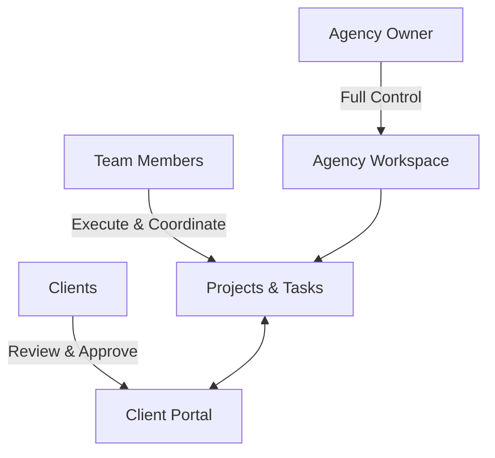
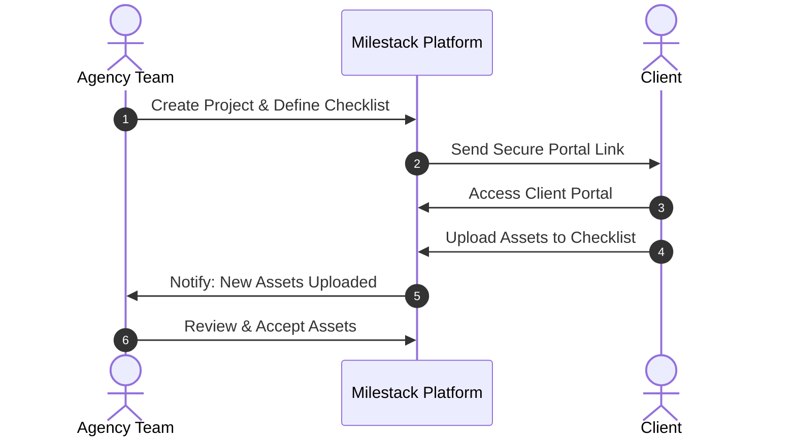
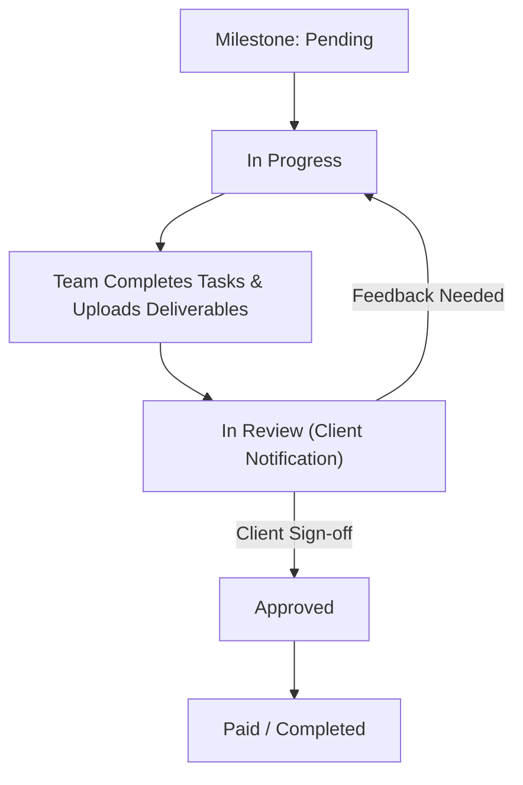

This is a [Next.js](https://nextjs.org) project bootstrapped with [`create-next-app`](https://nextjs.org/docs/app/api-reference/cli/create-next-app).

## Getting Started

First, run the development server:

```bash
npm run dev
# or
yarn dev
# or
pnpm dev
# or
bun dev
```# Milestack — Client Collaboration & Project Hub for Agencies

Milestack is a unified collaboration workspace designed specifically for modern agencies and their clients. It brings project planning, asset collection, milestone approvals, team task management, and client communication into one clear, professional dashboard.

Instead of juggling lost email threads, messy cloud storage folders, and scattered messaging apps, Milestack gives agencies and clients a single shared source of truth.

---

## The Core Problem & The Solution

### The Problem
When creative, digital, and development agencies work with clients, communication often breaks down across too many disconnected tools:
* Project requirements and brand assets get buried in email threads.
* Clients struggle to know which stage a project is in or what needs their review.
* Deliverable files get overwritten or confused without clear version history.
* Getting formal client approval on milestones and payments feels disjointed and slow.

### The Solution
Milestack simplifies the entire client lifecycle into an organized, stage-by-stage journey:
* **One Dashboard for Agencies**: Full visibility over all active projects, team task assignments, pending reviews, and financial milestones.
* **Frictionless Client Portal**: Clients access their dedicated project space securely via private links—no complex account setup required.
* **Structured Stage Gating**: Work moves forward systematically through clear milestones, approval checkpoints, and task tracking.

---

## User Roles in the System

Milestack is built around three distinct types of users, each with tailored views and permissions:



### 1. Agency Owner
* Creates and brands the agency workspace.
* Invites and manages team members and designations.
* Oversees financial tracking, payments, and agency subscription plans.
* Has full administrative permissions across all agency projects and client relationships.

### 2. Team Member
* Collaborates on assigned projects.
* Creates, updates, and completes day-to-day project tasks.
* Uploads deliverables, manages file revisions, and chats with team members and clients.
* Moves milestones through work and review stages.

### 3. Client
* Accesses a clean, private client portal via an encrypted magic link.
* Fills out the onboarding checklist by uploading requested assets (logos, guidelines, credentials).
* Reviews completed milestones, previewing deliverables and leaving direct feedback.
* Approves milestones so work can seamlessly transition into the next phase.

---

## High-Level System Architecture & Flow

The system is organized into three interconnected layers:

```mermaid
graph LR
    subgraph Agency_Hub [Agency Hub]
        Dashboard["Overview Dashboard"]
        ProjectWorkspace["Project Management"]
        TeamHub["Team & Staff Management"]
        SettingsHub["Agency Settings"]
    end

    subgraph Collaboration_Engine [Collaboration Engine]
        Milestones["Milestones & Stages"]
        Tasks["Task Breakdown"]
        Files["Asset & Version Control"]
        Activity["Real-time Activity Log"]
    end

    subgraph Client_Experience [Client Experience]
        MagicLink["Secure Magic Link"]
        PortalView["Client Project Portal"]
        OnboardingChecklist["Asset Collection"]
        Approvals["Review & Sign-off"]
    end

    Agency_Hub --> Collaboration_Engine
    Collaboration_Engine <--> Client_Experience
```



---

## Step-by-Step System Journeys

### 1. Agency Setup & Workspace Creation
1. **Registration**: An agency leader signs up and claims their agency name and unique workspace link.
2. **Branding & Profile**: The agency sets up its profile, website link, and company branding.
3. **Staff Onboarding**: The owner sends team invitations by email. When team members accept, they join the agency directory with designated roles.

---

### 2. Client & Project Kickoff
1. **Add Client**: The agency registers a client profile with company details and contact information.
2. **Create Project**: The agency launches a new project linked to that client, specifying deadlines and high-level goals.
3. **Assign Team**: Relevant agency staff members are assigned to the project workspace.
4. **Prepare Onboarding Checklist**: The agency defines the initial assets and information needed from the client (e.g., brand guidelines, vector logos, copy documents).

---

### 3. Client Portal Access & Asset Collection
1. **Magic Link Generation**: Milestack creates an encrypted, passwordless client access link.
2. **Client Portal Entry**: The client opens their dedicated portal in any web browser without needing to remember a password.
3. **Fulfilling Checklist**: The client views the required onboarding items, uploads files directly, and marks items complete.
4. **Agency Verification**: The agency team inspects uploaded assets, approving them or requesting revisions.



---

### 4. Milestone Execution & Task Workflow
Projects are organized into sequential milestones representing key project chapters (e.g., Discovery, UI Design, Development, Launch).

1. **Breakdown into Tasks**: Each milestone contains individual tasks assigned to team members with priorities and deadlines.
2. **Progress Computation**: As tasks are marked complete, the milestone progress bar updates automatically.
3. **Deliverable Uploads**: The agency team attaches deliverable files directly to the active milestone.
4. **Internal & External Discussion**: Team members and clients exchange notes and feedback right where the work lives.



---

### 5. Review, Approval & Payment Verification
1. **Submit for Review**: When work on a milestone is ready, the agency changes the status to `In Review`.
2. **Client Notification**: The client receives an alert to inspect the new deliverable files.
3. **Feedback or Sign-Off**: 
   * If revisions are requested, notes are added and the team continues refinement.
   * If approved, the client signs off on the milestone.
4. **Payment Tracking**: Once signed off, financial milestones can be recorded as settled, unlocking the subsequent milestone in the sequence.

---

## Core System Modules

| Module | What It Does | Who Uses It |
| :--- | :--- | :--- |
| **Executive Dashboard** | High-level summary of active projects, pending milestones, task counts, and live agency activity. | Agency Owners & Staff |
| **Project Workspace** | Central command center for an individual project: status, team assignments, files, and milestones. | Agency Team & Clients |
| **Milestone Engine** | Stage-by-stage progression system tracking deliverables, deadlines, review status, and financial amounts. | Agency Team & Clients |
| **Task Ledger** | Fine-grained to-do items inside each milestone with assignees, priorities, and instant completion toggles. | Agency Team Members |
| **Client Portal** | Dedicated external interface tailored specifically for clients to submit assets, review work, and approve stages. | Clients |
| **Digital Asset Manager** | File repository grouped by project and milestone, complete with version tracking and clean download links. | Agency Team & Clients |
| **Live Activity Stream** | Real-time audit trail recording uploads, status changes, reviews, and comments across all agency operations. | Agency Owners & Staff |
| **Agency Settings** | Administrative panel for team roles, agency details, security preferences, and subscription tier management. | Agency Owners |

---

## Design Principles Behind Milestack

1. **Radical Simplicity for Clients**
   Clients should never feel overwhelmed by internal agency complexity. They get a focused, clean environment highlighting exactly what requires their attention right now.

2. **Stage-Gated Accountability**
   By organizing projects around clear milestones rather than endless back-and-forth chats, both parties agree on expectations before moving on to the next phase.

3. **Frictionless Collaboration**
   Eliminating login hurdles for clients through secure links increases client responsiveness and prevents project bottlenecks.

4. **Single Source of Truth**
   Every decision, deliverable, approved item, and payment record is stored in context with its respective project, preventing miscommunication and disputes.


Open [http://localhost:3000](http://localhost:3000) with your browser to see the result.

You can start editing the page by modifying `app/page.tsx`. The page auto-updates as you edit the file.

This project uses [`next/font`](https://nextjs.org/docs/app/building-your-application/optimizing/fonts) to automatically optimize and load [Geist](https://vercel.com/font), a new font family for Vercel.

## Learn More

To learn more about Next.js, take a look at the following resources:

- [Next.js Documentation](https://nextjs.org/docs) - learn about Next.js features and API.
- [Learn Next.js](https://nextjs.org/learn) - an interactive Next.js tutorial.

You can check out [the Next.js GitHub repository](https://github.com/vercel/next.js) - your feedback and contributions are welcome!

## Deploy on Vercel

The easiest way to deploy your Next.js app is to use the [Vercel Platform](https://vercel.com/new?utm_medium=default-template&filter=next.js&utm_source=create-next-app&utm_campaign=create-next-app-readme) from the creators of Next.js.

Check out our [Next.js deployment documentation](https://nextjs.org/docs/app/building-your-application/deploying) for more details.
